<div align="center">
  

  <br />

  <a href="https://kraiyos-dev.vercel.app">
    
  </a>
  <a href="https://www.linkedin.com/in/kraiyos-wanna/">
    
  </a>
  <a href="mailto:kraiyos.wanna@gmail.com">
    
  </a>
  <a href="https://kraiyos-dev.vercel.app/kraiyos-wanna-cv.pdf">
    
  </a>

  <br /><br />

  
</div>

## I turn messy real-world problems into working AI systems.

I'm an **AI Engineer in Bangkok** with more than six years across mechanical engineering, backend development, manufacturing data, and industrial digitalization. That path taught me to see the whole system: how data is created, where it breaks, what the user actually needs, and how software must behave outside a notebook.

Today, I build with **computer vision, data engineering, machine learning, LLM/RAG, and agentic AI** using Python and TypeScript. I'm especially interested in applied AI roles where models, data, and dependable software need to work as one product.

> **My edge:** I don't only ask, “Can the model work?” I ask, “Can the entire system deliver a useful and traceable decision?”

### `NOW / 2026`

| | Current chapter |
|---|---|
| 🤖 | **AI Engineer Intern · Artificial Intelligence Association of Thailand (AIAT)** — Jul 2026–Present *(in progress)* |
| 🧠 | Prototyping LLM applications, agentic systems, data pipelines, and AI-enabled workflows; researching LLM training from scratch for sovereign AI. |
| ⚡ | **Super AI Engineer Season 6 · Level 3** — selected as **1 of 156** participants advancing from **10,000+ applicants**. |
| 🎯 | Open to **AI Engineer, Applied AI Engineer, ML Engineer, AI Software Engineer, and Data/AI Engineer** opportunities. |

## How I build intelligence

<table>
  <tr>
    <td width="25%" valign="top">
      <h3>01 · SENSE</h3>
      <p>Turn images, documents, events, and operational signals into usable data.</p>
      <code>Computer Vision</code><br />
      <code>EDA</code> <code>Data Engineering</code>
    </td>
    <td width="25%" valign="top">
      <h3>02 · REASON</h3>
      <p>Choose models and retrieval strategies around the actual decision.</p>
      <code>ML / Deep Learning</code><br />
      <code>LLM</code> <code>RAG</code> <code>Agents</code>
    </td>
    <td width="25%" valign="top">
      <h3>03 · BUILD</h3>
      <p>Wrap intelligence in software that people can understand and use.</p>
      <code>FastAPI</code> <code>Next.js</code><br />
      <code>PostgreSQL</code> <code>Supabase</code>
    </td>
    <td width="25%" valign="top">
      <h3>04 · OPERATE</h3>
      <p>Deliver with traceability, feedback loops, and real constraints in mind.</p>
      <code>Git / CI/CD</code><br />
      <code>Evaluation</code> <code>Observability</code>
    </td>
  </tr>
</table>

## Selected work

<table>
  <tr>
    <td width="50%" valign="top">
      <h3>Domestic Violence Analytics</h3>
      <p><strong>Data Analytics · EDA · Insight Design</strong></p>
      <p>Turned 877 sensitive records into an explainable dashboard covering risk factors, affected groups, geography, time patterns, reporting behavior, and policy priorities—with limitations made visible.</p>
      <a href="https://superaiss6-603081-kraiyos-domesticviolence.vercel.app/">
        
      </a>
      <a href="https://github.com/KraiyosW/SuperAIEngSS6-MiniHackathon1-DomesticViolence">
        
      </a>
    </td>
    <td width="50%" valign="top">
      <h3>FahMai Contextual RAG</h3>
      <p><strong>Hybrid Retrieval · Thai NLP · LLM</strong></p>
      <p>Built a contextual retrieval pipeline combining BM25 and FAISS, multilingual embeddings, query refinement, and grounded answer generation for fragmented product and policy knowledge.</p>
      <a href="https://github.com/KraiyosW/MiniHackathon3-FahMai-ChatBot-RAG">
        
      </a>
    </td>
  </tr>
  <tr>
    <td width="50%" valign="top">
      <h3>Thai Unseen</h3>
      <p><strong>AI Product · Full-Stack · UX</strong></p>
      <p>Designed a bilingual travel concept for discovering Thailand's hidden gems through AI-assisted routes, verified local guides, community connections, and transparent local transport.</p>
      <a href="https://thailand-tourism-mini-hackathon-tid.vercel.app">
        
      </a>
      <a href="https://github.com/KraiyosW/Thailand-Tourism-Mini-Hackathon-TidCORS">
        
      </a>
    </td>
    <td width="50%" valign="top">
      <h3>Piston Defect Intelligence</h3>
      <p><strong>Production System · Data · Traceability</strong></p>
      <p>Replaced paper-based inspection records with barcode traceability, a live quality dashboard, role-aware access, and a critical-event notification path measured at under 500 ms.</p>
      <a href="https://kraiyos-dev.vercel.app/projects/piston-defect-recording-system">
        
      </a>
    </td>
  </tr>
</table>

## Toolkit

<div align="center">

**AI · ML · DATA**


**SYSTEMS · PRODUCT**


</div>

## Engineering journey

```text
MECHANICAL ENGINEERING       BACKEND & FULL-STACK       APPLIED AI
        2015–2023        ─────────► 2023–2026 ─────────► 2026–NOW
   physical systems          digital systems        intelligent systems
```

This is not a reset—it is a compounding path. Mechanical engineering gave me systems thinking. Production taught me operational reality. Software gave me a way to encode better workflows. AI lets me build systems that can perceive, reason, and assist.

## GitHub signal

<div align="center">
  
  <br />
  
  
  <br />
  
</div>

<div align="center">
  <br />
  <strong>Have an AI problem that needs to become a real system?</strong>
  <br />
  <a href="mailto:kraiyos.wanna@gmail.com">Let's build something useful.</a>
  <br /><br />
  <sub>Bangkok, Thailand · Open to AI engineering opportunities</sub>
</div>
